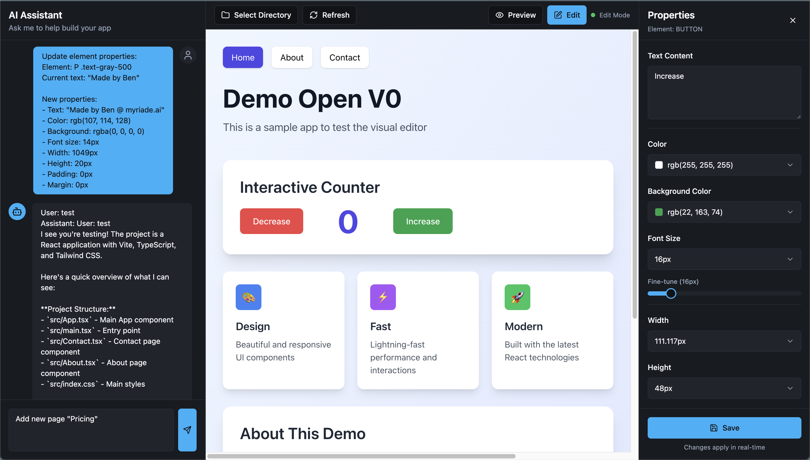

# Open V0

An open-source visual editor for frontend applications, powered by AI. Think of it as an open alternative to [V0](https://v0.dev) with the visual editing capabilities inspired by [Framer](https://framer.com).



## ✨ Features

- **🤖 AI-Powered Editing** — Chat with Claude AI to modify your frontend code in real-time
- **🎨 Visual Properties Panel** — Edit colors, typography, spacing, and more without touching code
- **🖼️ Live Preview** — See your changes instantly in an embedded iframe
- **🔧 Framework Agnostic** — Works with React, Vue, Svelte, or any frontend that runs in a browser
- **📁 Edit Any Project** — Point it at your local dev server and start editing

## 🚀 Quick Start

```bash
# Clone the repository
git clone https://github.com/your-username/open-v0.git
cd open-v0

# Start all services (editor + backend + demo project)
./start-dev.sh
```

This launches:

- **Editor** → http://localhost:8080
- **Backend API** → http://localhost:54321
- **Demo Project** → http://localhost:3000

## 🎯 Use with Your Own Project

1. Run `./start-dev.sh`
2. Open http://localhost:8080
3. Click "Select Directory" and enter your project path
4. Click "Start" to run your project's dev server
5. Start editing with AI!

## 🏗️ Architecture

Open V0 consists of three services:

| Service            | Port  | Description                                       |
| ------------------ | ----- | ------------------------------------------------- |
| **Editor**         | 8080  | Main UI with Chat, Preview, and Properties panels |
| **Backend API**    | 54321 | FastAPI server with Claude AI integration         |
| **Target Project** | 3000  | Your frontend app (any framework)                 |

See [DEVELOPMENT.md](DEVELOPMENT.md) for detailed architecture and development guide.

## 📋 Requirements

- Node.js 18+
- Python 3.8+
- Anthropic API key (for Claude)

## ⚙️ Configuration

### Backend (backend/.env)

```bash
ANTHROPIC_API_KEY=sk-ant-...
```

## 🛠️ Tech Stack

**Frontend**

- React 18, TypeScript, Vite 5
- shadcn/ui, Tailwind CSS
- TanStack React Query

**Backend**

- Python FastAPI
- Claude AI via Agentlys
- Uvicorn ASGI server

## 📖 Documentation

- [DEVELOPMENT.md](DEVELOPMENT.md) — Architecture and development guide
- [AGENTS.md](AGENTS.md) — AI agent context and coding conventions
- [backend/README.md](backend/README.md) — Backend setup and API docs

## 🤝 Contributing

Contributions are welcome! Please read the development guide before submitting PRs.

## 📄 License

MIT
